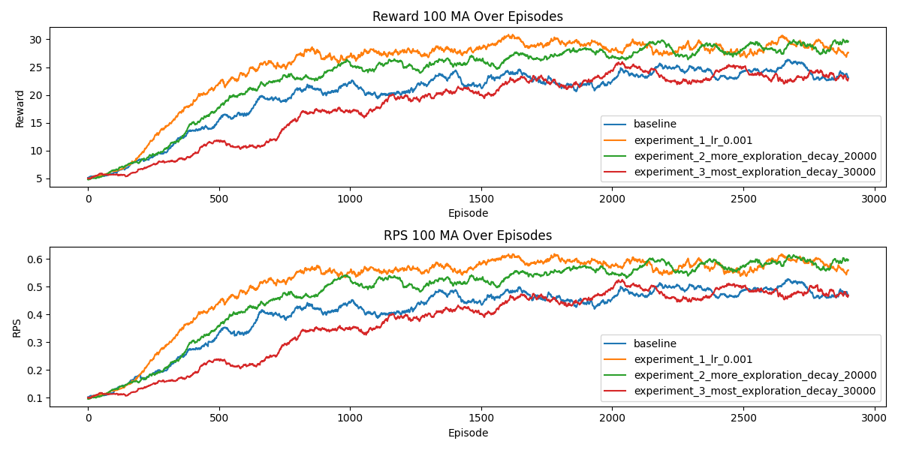
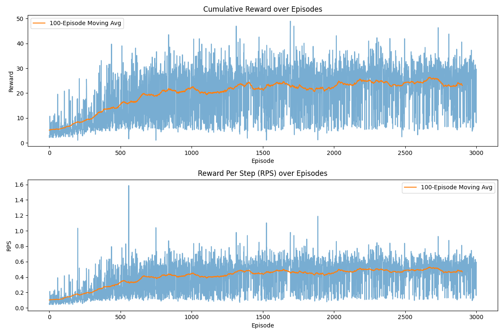
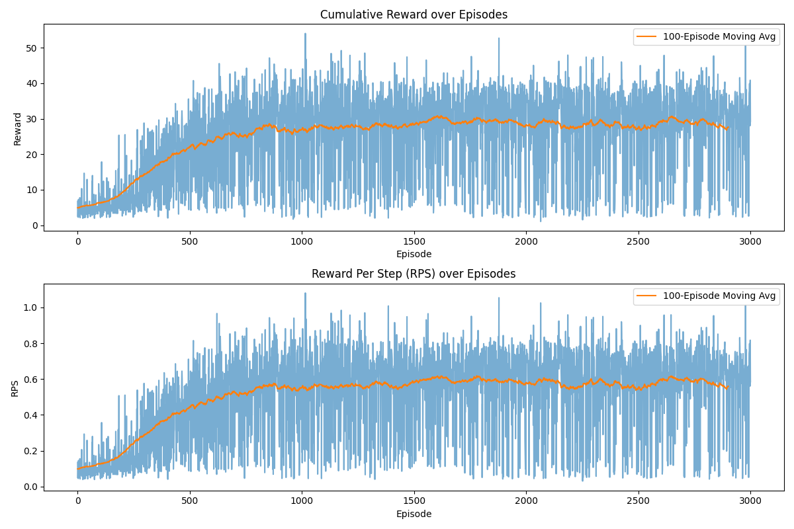
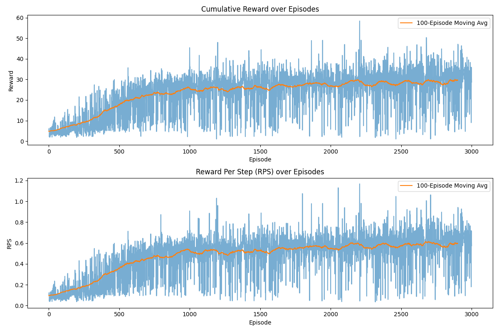
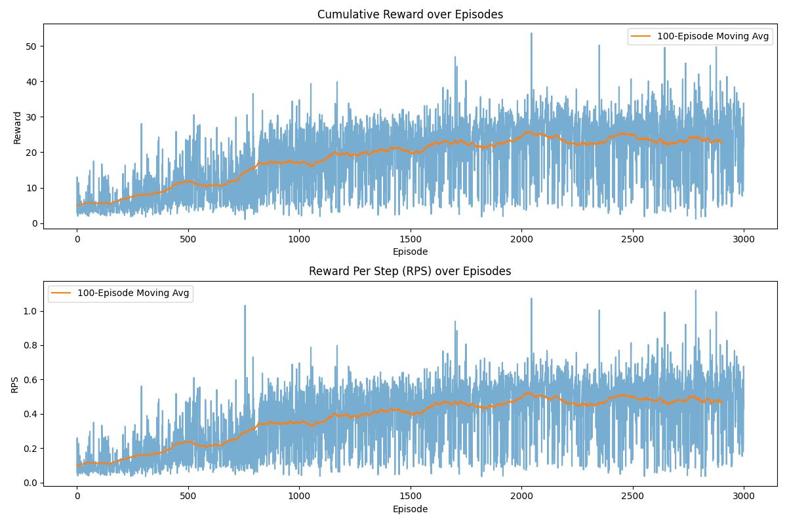

# Robot Control: Deep Q-Network (DQN) for Object Manipulation

This repository contains the implementation of a Double Deep Q-Network (DDQN) designed to control a robotic arm equipped with a claw end-effector. The objective is to navigate to an object on a table and drag it to a specified goal location using a discrete action space.

## Architecture & State Space
* **State Space:** A 6-dimensional high-level continuous vector containing the 2D `(x, y)` coordinates of the end-effector, the object, and the goal.
* **Action Space:** 8 discrete directional movements mapping to a Cartesian circle.
* **Network:** An MLP (`[256, 256, 128]`) utilizing ReLU activations.
* **Algorithm:** Double DQN (DDQN) with Polyak averaging (Soft Updates, $\tau = 0.005$) to stabilize target Q-value estimations. Model saving was dynamically handled by tracking the highest 100-episode moving average of **Reward Per Step (RPS)** to prioritize policy efficiency over raw cumulative reward.
* **Reward Function:** The environment yields a dense reward at each step defined as `1/(ee_to_obj) + 1/(obj_to_goal)`.

---

## Performance Summary
**Note on Computational Limits:** Due to the CPU-bound nature of the physics simulation, a single 3000-episode training run took approximately 2 hours to complete. As a result, hyperparameter tuning was strictly limited to the four experimental runs detailed below.

Below is the combined 100-Episode Moving Average comparison of both the Cumulative Reward and the Reward Per Step (RPS) across all four configurations.

---

## Experimental Runs & Hyperparameter Tuning

### 1. Training Run: Baseline
* **Hyperparameters:** * `gamma`: 0.99
  * `eps_start`: 0.9
  * `eps_end`: 0.05
  * `eps_decay`: 10000
  * `tau`: 0.005
  * `batch_size`: 128
  * `learning_rate`: 0.0001
  * `update_freq`: 4
  * `buffer_capacity`: 10000
  * `num_episodes`: 3000
* **Performance:** Plateaued at a final average reward of 23.09 and an RPS of 0.47.
* **Discussion:** The agent successfully learned to approach the object but fell into a Local Optimum Trap. Because the environment heavily incentivizes minimizing the end-effector-to-object distance, the agent quickly learned to center the claw over the object. However, it failed to confidently discover the sequence of actions required to move the trapped object to the goal, resulting in a vibrating and hovering behavior where it safely farmed the initial proximity reward until the episode truncated. 

### 2. Training Run: Experiment 1 (The "Impatient" Agent)
* **Hyperparameters:** * `gamma`: 0.99
  * `eps_start`: 0.9
  * `eps_end`: 0.05
  * `eps_decay`: 10000
  * `tau`: 0.005
  * `batch_size`: 128
  * `learning_rate`: 0.001
  * `update_freq`: 4
  * `buffer_capacity`: 10000
  * `num_episodes`: 3000
* **Performance:** Rapid early improvement, peaking at an average reward of 30.58 around episode 1700, but ultimately destabilizing and dropping to 27.64 (RPS: 0.56) by the end of training.
* **Discussion:** The aggressive $0.001$ learning rate provided the necessary gradient momentum to smash through the local optimum trap, allowing the network to occasionally discover the massive reward of successfully moving the object to the goal. However, $0.001$ is too large for late-stage fine-tuning. Combined with the small replay buffer ($10,000$), the network suffered from catastrophic forgetting; it rapidly overwrote its best dragging trajectories and overshot optimal target Q-values, causing late-stage variance and performance degradation.

### 3. Training Run: Experiment 2 (The Golden Configuration)
* **Hyperparameters:** * `gamma`: 0.99
  * `eps_start`: 1.0
  * `eps_end`: 0.05
  * `eps_decay`: 20000
  * `tau`: 0.005
  * `batch_size`: 256
  * `learning_rate`: 0.0006
  * `update_freq`: 4
  * `buffer_capacity`: 100000
  * `num_episodes`: 3000
* **Performance:** Achieved the highest and most mathematically stable convergence, finishing with an average reward of 29.63 and an RPS of 0.60.
* **Discussion:** This configuration yielded the best empirical results. Extending the `eps_decay` to 20,000 ensured the agent gathered diverse, off-policy experiences, while the larger $100,000$ capacity memory bank cured the catastrophic forgetting seen in Experiment 1. Dropping the learning rate slightly to $0.0006$ and pairing it with a larger batch size ($256$) smoothed out the gradient steps. **Physical Observation:** While mathematically stable, the agent did not achieve perfectly confident physical behavior. It still exhibited hovering and vibrating tendencies, albeit less erratically than the baseline, and successfully delivered the object to the goal in roughly 50% of the test rollouts. 

### 4. Training Run: Experiment 3 (The Over-Explorer)
* **Hyperparameters:** * `gamma`: 0.99
  * `eps_start`: 1.0
  * `eps_end`: 0.1
  * `eps_decay`: 30000
  * `tau`: 0.005
  * `batch_size`: 256
  * `learning_rate`: 0.001
  * `update_freq`: 4
  * `buffer_capacity`: 80000
  * `num_episodes`: 3000
* **Performance:** Underperformed significantly, regressing to a final average reward of 22.90 and an RPS of 0.47.
* **Discussion:** This run failed due to the starvation of optimal trajectories. By extending the decay curve to 30,000 and forcing the agent to take random actions 10% of the time indefinitely, the agent struggled to execute consecutive, high-precision maneuvers. The replay buffer became bloated with noisy, sub-optimal transitions. When the aggressive 0.001 learning rate sampled this chaotic buffer, the off-policy learning failed to smoothly converge on the optimal Q-values, trapping the agent in a state of continuous, unrefined exploration.

